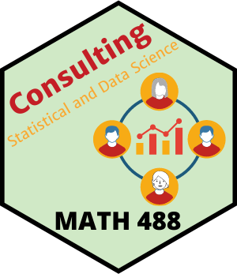

# Welcome

|    |   |
|----|----|
| | Current trends among industries ranging from insurance to manufacturing (as well as many other professions) are pushing the need for data literacy and team based problem solving. *MATH 488 - Data Science and Statistical Consulting* provides learners with an experience that mimics industry implementation of data handling, data analysis, and project complexity. |

The course is designed to support our mathematical sciences and data science majors as well as our statistics and data science minors. 

# What do student's say about this course?

> I love this class, I wish that I could have taken 12 credits of this class with different projects.   
> -[Jashon Newlun](https://www.linkedin.com/in/jashon-newlun-8450a5133/)-

Other quotes are shared [here](quotes.md)

# Who is served by this course?

Learners that want an experience in analytics consulting that leverages statistical modelling, machine learning, and advanced data handling and visualization techniques to solve real world problems with data.

## Course Mission Statement

Apply a team-based project consulting process to answer client driven questions with the use of modelling methods on large complex data in varied domains. 

## Course Outcomes

As a successful team member, you will be able to

1. Establish and document the ethical guidelines of a data science professional.
2. Describe and practice the life cycle of team based data science projects.
3. Develop communication skills needed to discuss technical, analytical content with others outside of their domain.
4. Apply methods from statistics or data science for specific business requests.
5. Present analytics results to a client.

## Extra Information

The [syllabus](syllabus.md) provides context for the details of how the class will operate and how grades will be earned.
